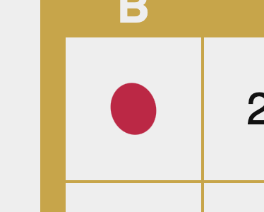
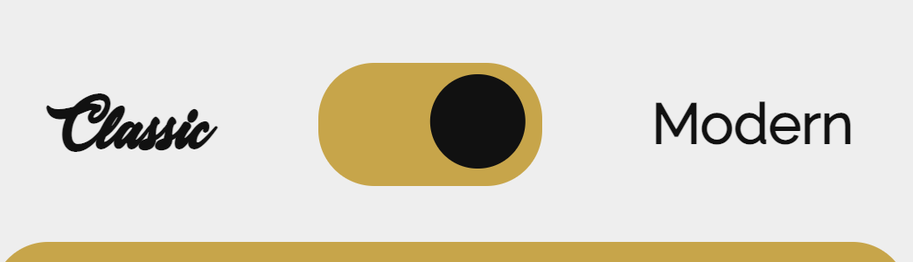
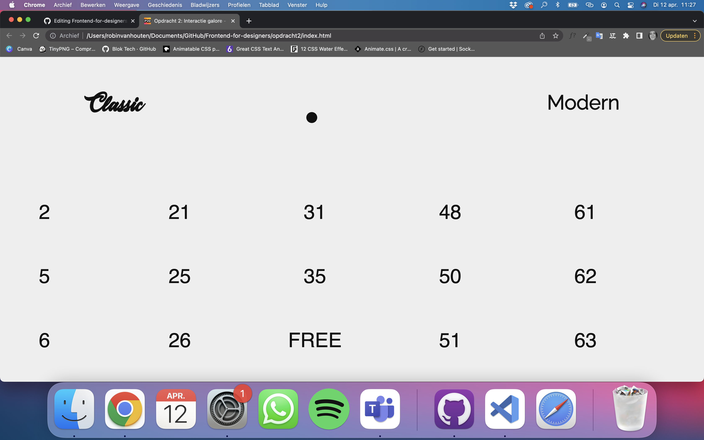
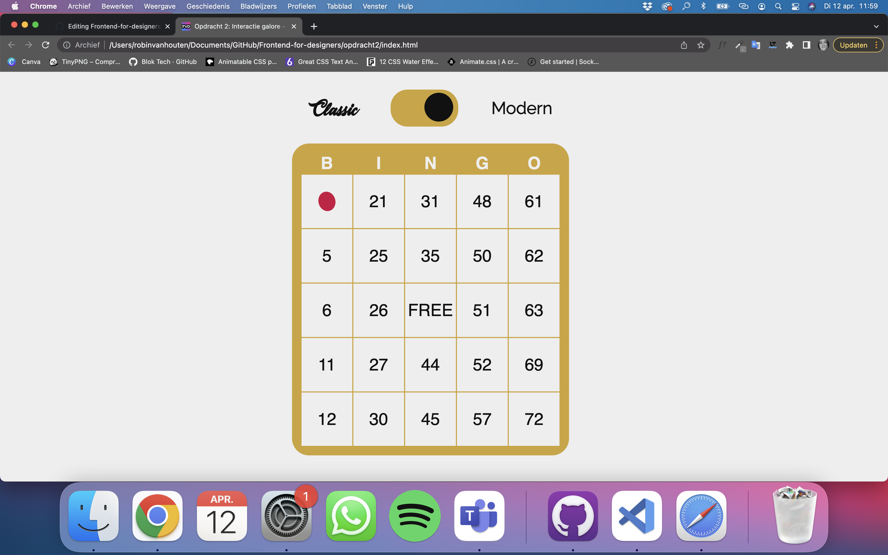

# Procesverslag
**Auteur:** Robin van Houten

**De opdrachten:** [opdracht 1](opdracht1/index.html) en [opdracht 2](opdracht2/index.html)

Markdown is een simpele manier om HTML te schrijven.  
Markdown cheat cheet: [Hulp bij het schrijven van Markdown](https://github.com/adam-p/markdown-here/wiki/Markdown-Cheatsheet).

Nb. De standaardstructuur en de spartaanse opmaak van de README.md zijn helemaal prima. Het gaat om de inhoud van je procesverslag. Besteedt de tijd voor pracht en praal aan je website.

Nb. Door *open* toe te voegen aan een *details* element kun je deze standaard open zetten. Fijn om dat steeds voor de relevante stuk(ken) te doen.

## Bronnenlijst
  1. <a href="https://developer.mozilla.org/en-US/docs/Web/CSS/CSS_animated_properties" target="_blank">Animatable CSS properties</a>
  2. <a href="https://www.sliderrevolution.com/resources/css-text-animation/" target="_blank">Great CSS Text Animation</a>
  3. <a href="https://freefrontend.com/css-water-effects/" target="_blank">12 CSS Water Effects</a>
  4. <a href="https://animate.style/" target="_blank">Animate.css</a>

## Opdracht 1 plan

  
uitwerken na schetsen idee (voor week 2)

  ### Je storyboard:
  

  ### Je ambitie: 
  Aan deze technieken/punten wil ik werken:
  - CSS beheers ik al vrij aardig ik heb alleen niet eerder echt gewerkt met animeren dat zou ik graag willen leren
  - Hoe je animeert in een soort van filmpje. Hiermee bedoel ik dat er een begin is en een eind en je voort kan borduren op eerdere animaties
  - Mezelf uitdagen om meerdere animaties te gebruiken (heb het wel opgedeeld in delen mocht het niet lukken dat ik dan nog wel wat heb staan)
 

## Opdracht 1 reflectie

  
uitwerken bij afronden opdracht (voor week 3)

  ### Je uitkomst - karakteristiek screenshot(s):
  

  ### Dit ging goed/Heb ik geleerd: 
  Om de tekst vol te laten lopen heb ik geleerd met een before en after te werken. Zoals hier te zien is probeerde ik eerst alles in alleen een before te doen maar omddat ik 'up' apart moest stijlen om de positie te veranderen heb ik ook gebruik gemaakt van een after. Daarnaast was het werken met hiermee nieuw en ook content had ik nog niet eerder gebruikt of gezien.

  

  ### Dit was lastig/Is niet gelukt:
  Ik heb heel lang naar deze fout gekeken. Uit eindelijk bleek mijn width op mijn h1 te krap te zijn. Ook had de before een soort schaduw (Dit is ook wel te zien om de tekst heen) die heel gek stond en dus ook verdween doormiddel van de animatie. Dit bleek een text-shadow te zijn die ik per ongeluk op de body gezet had in plaats van op de h1.

  

## Opdracht 2 plan

  
uitwerken na schetsen idee (voor week 4)

  
   ### Plan: 
  
  Ik wil graag de use case bingo uitwerken. Ik heb nagedacht over welke twee bedieningen ik wil gebruiken en dat is muis(klikken) en stem gebruik zodat er bingo geroepen kan worden. Om dicht te blijven bij het originele spel is stem gebruik denk ik de meest logische stap.
  
  Ik ben er nog niet uit wat ik wil doen met sorteren/filteren/zoeken/opslaan.
  
 Je kunt op je eigen kaart de getallen aanklikken dit moet dan of ouderweds een fiche zijn of modern stempelpen. Het moet ook mogelijk zijn om een verkeerde cijfer weg te stemeplen en hierdoor krijg je dus een valse bingo (buiten scope)!

  ### Je ontwerp:
  

  ### Je ambitie: 
  Aan deze technieken/punten wil ik werken:
  - Sowieso mijn Javascript kennis ophalen en verbeteren want ik blijf dat erg moeilijk vinden.
  - Misschien een switch tussen modern en oude bingo (betreft manier van wegstempelen).
  - Ook gebruik van stem heb ik nog nooit mee gewerkt en hier wil ik graag meer van weten.

## Opdracht 2 test

  
uitwerken na testen (week 6/7)

  Neem minimaal 5 bevindingen op:

  ### Bevinding 1:
  De cijfers kregen een andere kleur in plaats van dat er echt een fiche of een stempel op kwam. 
  (ik heb hier geen screenshot van gemaakt voordat het was opgelost)

  #### oplossing:
  Dit heb ik hierna aangepast in een rode cirkel (dit omdat dat voor zowel een stempel als een fiche kan)
   

  ### Bevinding 2:
  Ik had nog geen switch om te kunnen wisselen tussen het oude en nieuwe spel. Hierdoor was het stukje forgiveness ook niet aanwezig.

  #### oplossing:
  Ik heb bovenin een switch geplaatst zodat de gebruiker zelf kan kiezen of ze hun gemaakte fouten nog kunnen herstellen.
   
  
  ### Bevinding 3:
  Ik heb de kaart gemaakt op mobile first hierdoor was de responsive voor groot scherm nog niet helemaal op orde
   

  #### oplossing:
  Blijkbaar had ik nog een aantal px'jes in plaats van alles in em. (Moet daar toch nog aan wennen 😉 ). Daarnaast was mijn clamp wel heel erg groot en de   width van de kaart. Dit heb ik beide minder gemaakt waardoor de kaart een stuk kleiner is en overzichtelijk in 1x. 
   
  
   ### Bevinding 4:
  Ik werk zelf altijd in darkmode dus qua kleuren was die in orde maar vervolgens switchde ik naar light mode en bleek er helemaal geen kleur aanwezig te   zijn dit moest dus nog opgelost worden.
   

  #### oplossing:
  ik heb kleuren toegevoegd aan de light mode
   

  ### Bevinding 5:
  Naast dat er nog tegen de applicatie gesproken moet kunnen worden is het ook de bedoeling dat je met toetsenbord kan bedienen.

  #### oplossing:
  Om dit visueel te maken heb ik een focus toe gevoegd. Hierdoor zie je ook als iets geselecteerd is met je toetsenbord.
   
  

## Opdracht 2 reflectie

  
uitwerken bij afronden opdracht (voor week 8)

  ### Je uitkomst - karakteristiek screenshot(s):
  

  ### Dit ging goed/Heb ik geleerd: 
  Korte omschrijving met plaatje(s)

  

  ### Dit was lastig/Is niet gelukt:
  Korte omschrijving met plaatje(s)

  

