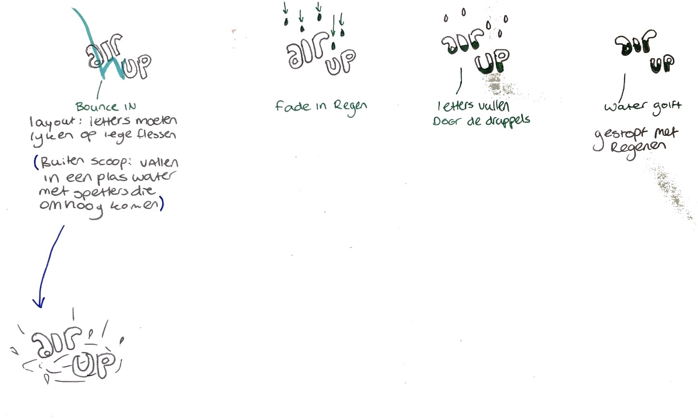
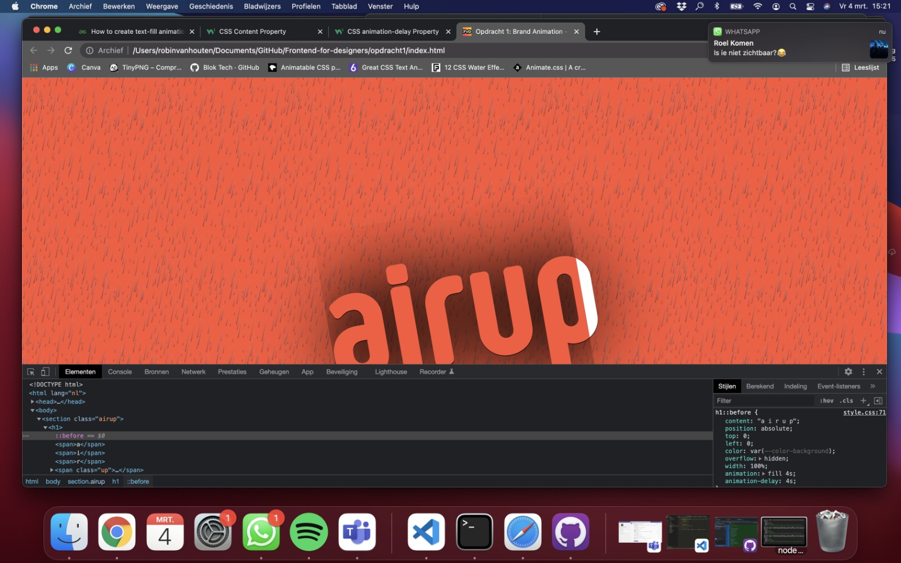

# Procesverslag
**Auteur:** Robin van Houten

**De opdrachten:** [opdracht 1](opdracht1/index.html) en [opdracht 2](opdracht2/index.html)

Markdown is een simpele manier om HTML te schrijven.  
Markdown cheat cheet: [Hulp bij het schrijven van Markdown](https://github.com/adam-p/markdown-here/wiki/Markdown-Cheatsheet).

Nb. De standaardstructuur en de spartaanse opmaak van de README.md zijn helemaal prima. Het gaat om de inhoud van je procesverslag. Besteedt de tijd voor pracht en praal aan je website.

Nb. Door *open* toe te voegen aan een *details* element kun je deze standaard open zetten. Fijn om dat steeds voor de relevante stuk(ken) te doen.

## Bronnenlijst
  1. <a href="https://developer.mozilla.org/en-US/docs/Web/CSS/CSS_animated_properties" target="_blank">Animatable CSS properties</a>
  2. <a href="https://www.sliderrevolution.com/resources/css-text-animation/" target="_blank">Great CSS Text Animation</a>
  3. <a href="https://freefrontend.com/css-water-effects/" target="_blank">12 CSS Water Effects</a>
  4. <a href="https://animate.style/" target="_blank">Animate.css</a>

## Opdracht 1 plan

  
uitwerken na schetsen idee (voor week 2)

  ### Je storyboard:
  

  ### Je ambitie: 
  Aan deze technieken/punten wil ik werken:
  - CSS beheers ik al vrij aardig ik heb alleen niet eerder echt gewerkt met animeren dat zou ik graag willen leren
  - Hoe je animeert in een soort van filmpje. Hiermee bedoel ik dat er een begin is en een eind en je voort kan borduren op eerdere animaties
  - Mezelf uitdagen om meerdere animaties te gebruiken (heb het wel opgedeeld in delen mocht het niet lukken dat ik dan nog wel wat heb staan)
 

## Opdracht 1 reflectie

  
uitwerken bij afronden opdracht (voor week 3)

  ### Je uitkomst - karakteristiek screenshot(s):
  

  ### Dit ging goed/Heb ik geleerd: 
  Om de tekst vol te laten lopen heb ik geleerd met een before en after te werken. Zoals hier te zien is probeerde ik eerst alles in alleen een before te doen maar omddat ik 'up' apart moest stijlen om de positie te veranderen heb ik ook gebruik gemaakt van een after. Daarnaast was het werken met hiermee nieuw en ook content had ik nog niet eerder gebruikt of gezien.

  

  ### Dit was lastig/Is niet gelukt:
  Ik heb heel lang naar deze fout gekeken. Uit eindelijk bleek mijn width op mijn h1 te krap te zijn. Ook had de before een soort schaduw (Dit is ook wel te zien om de tekst heen) die heel gek stond en dus ook verdween doormiddel van de animatie. Dit bleek een text-shadow te zijn die ik per ongeluk op de body gezet had in plaats van op de h1.

  

## Opdracht 2 plan

  
uitwerken na schetsen idee (voor week 4)

  Ik wil graag de use case bingo uitwerken. Ik heb nagedacht over welke twee bedieningen ik wil gebruiken en dat is muis(klikken) en stem gebruik van de cijfers.     Om dicht te blijven bij het originele spel is stem gebruik denk ik de meest logische stap.
  
  Ik ben er nog niet uit wat ik wil doen met sorteren/filteren/zoeken/opslaan.
  
  De bingo ballen wil ik bovenin random spawnen en dat je dan op je eigen kaart (die overigens ook random is) kan aanklikken dit moet dan of ouderweds een vice       zijn of modern een stempelpen. Het moet ook mogelijk zijn om een verkeerde cijfer weg te stemeplen en hierdoor krijg je dus een valse bingo!

  ### Je ontwerp:
  

  ### Je ambitie: 
  Aan deze technieken/punten wil ik werken:
  - Sowieso mijn Javascript kennis ophalen en verbeteren want ik blijf dat erg moeilijk vinden.
  - Ik gok werken met een soort sessie om op te slaan welke random ballen er gegenereerd zijn om later te checken of het een goede of valse bingo is.
  - Misschien een switch tussen modern en oude bingo (betreft manier van wegstempelen).

## Opdracht 2 test

  
uitwerken na testen (week 6/7)

  Neem minimaal 5 bevindingen op:

  ### Bevinding 1:
  Omschrijving van wat er nog niet orde was (tekst en afbeeding(en)).

  #### oplossing:
  Beschrijving hoe je het hebt hebt opgelost of als het niet gelukt is hoe je het zou oplossen (tekst en afbeeding(en)).

  ### Bevinding 2:
  Omschrijving van wat er nog niet orde was (tekst en afbeeding(en)).

  #### oplossing:
  Beschrijving hoe je het hebt hebt opgelost of als het niet gelukt is hoe je het zou oplossen (tekst en afbeeding(en)).

  ### Bevinding 3:
  ...

## Opdracht 2 reflectie

  
uitwerken bij afronden opdracht (voor week 8)

  ### Je uitkomst - karakteristiek screenshot(s):
  

  ### Dit ging goed/Heb ik geleerd: 
  Korte omschrijving met plaatje(s)

  

  ### Dit was lastig/Is niet gelukt:
  Korte omschrijving met plaatje(s)

  

